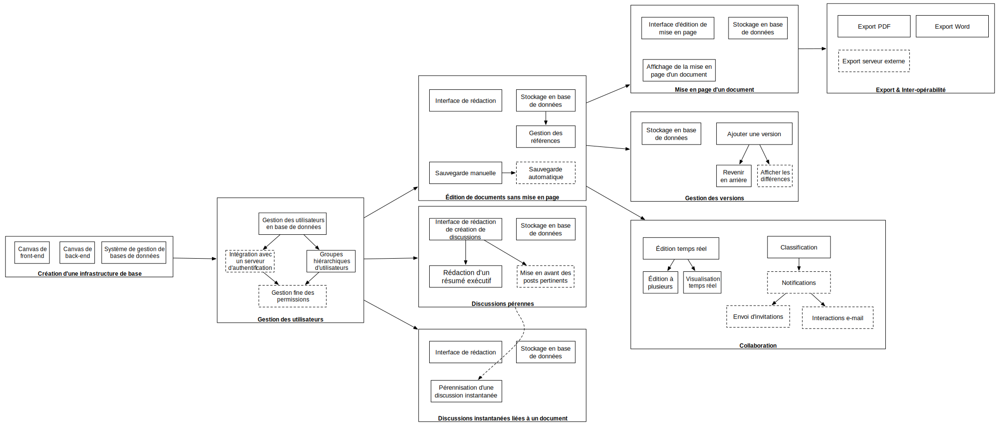

# CR Séance 3 - Groupe 7-COMM - 25/03/2013

La réunion s'est tenue de 11h10 à 12h. Étaient présents :

- *Encadrants* : Isabelle Augé-Blum Claude Guédat
- *Groupe projet* : Paul Mougel (Chef de projet), Guillaume Burel, Xiao Yu Feng, Fabio Guigou, Baptiste Metge

## Piqûre de rappel

Claude Guédat a fermement rappelé au chef de projet qu'il est impératif de transmettre l'ordre du jour et le lieu de rendez-vous préalablement à chaque réunion aux encadrants, ainsi que de leur communiquer le compte-rendu de la réunion ultérieurement.

## Résumé exécutif

Il a été demandé au chef de projet de procéder à un résumé exécutif du chemin parcouru depuis la précédente réunion.

On peut décrire notre projet comme un projet de création d'une plate-forme de rédaction collaborative de documents.
Cette plate-forme fera la part belle à la capitalisation des discussions et l'intégration poussée de ces dernières dans l'outil de rédaction. Un historique des versions et un mécanisme d'annotations et corrections lui sera adjoint.

Le cahier OSEO a avancé rapidement grâce à la motivation des étudiants. Aussi, le Business Canvas Model et un diagramme PERT a été réalisé.

## Business Canvas Model

Les secteurs de marché identifiés sont les suivants : 
 * les étudiants car souvent amenés à rédiger à plusieurs, ils sont aussi des appâts qui nous aideront à accroître notre visibilité et notre réputation
 * les leders d'opinion qui fédèrent une communauté
 * les petites structures qui n'ont pas les mêmes besoins que les grands groupes
 * les grands comptes
Nous alertons aussi Isabelle Augé-Blum sur le segment des chercheurs - et plus globalement de la communauté scientifique - dans le processus de rédaction d'articles à plusieurs, de relecture, de soumission automatique aux éditeurs et d'évaluation par les pairs - *peer review*.

Les business models retenus sont les suivants :
 * offre gratuite limitée en fonctionnalités pour grand public, à laquelle sera intégrée de la publicité
 * offre premium pour leaders d'opinion et petites structures avec abonnement mensuel
 * offre étudiants, identique à la version premium mais gratuite - peut être limitée à 4 ou 5 communautés de travail
 * offre entreprise, avec package abonnement annuel + installation/mainteance + support/formation, hébergé chez eux, sur mesure, avec intégration aux serveurs d'authentification et de collaboration de l'entreprise

Les coûts qui nous incombent se déclinent en développement, marketing, infrastructure, hébergement et support.
Nos partenaires sont les hébergeurs pour une offre élastique, ainsi que les agences de publicité : nous sommes relativement indépendants de part la nature même de notre domaine d'activités.
Les ressources dont nous pouvont bénéficier sont les avancées de la communauté open-source - attention tout de même aux contraintes posées par certaines licences -, l'infrastructure et notre équipe de développement.
Nos activités clés sont une équipe réactive, un hébergement fiable et un logiciel assez intuitif et simple pour limiter les besoins de formation.
La proposition d'un outil d'édition de documents collaboratif permettant de capitaliser sur les discussions, afin d'appliquer les principes agiles à la rédaction de documents constitue véritablement notre proposition de valeur. En effet, nous visons à limiter l'échange de documents de type *Word* par mail, intégrer les discussions dans leur contexte, itérer sur le processus de rédaction pour améliorer progressivement un document, proposer un historique des versions et donner la possibilité d'interagir avec la plate-forme via l'e-mail pour ne pas laisser de côté les réfractaires.
L'emphase est également portée sur la séparation nette entre le contenu et la mise en forme en poussant un langage de balisage léger (*markdown*) en sus de l'interface WYSIWYG, avec l'édition en ligne de styles, mais aussi en proposant l'export au format Word en prenant en compte le template de l'entreprise ou l'export au format LaTeX qui est, lui, plébiscité par les chercheurs.

## Méthode PERT

Nous avons privilégié la mise en place de la méthode PERT par rapport à un diagramme de GANTT pour découper les différentes phases de réalisation qui découperont notre projet.
En effet, cette méthode a été choisie en prenant en compte notre incapacité à effectuer des prévisions de délai : c'est à un cabinet de conseil qu'aurait pu être assignée cette étude.

### Marketing grands comptes

Nous participerons à des conférences pour parler de notre produit et rencontrer des professionnels et proposerons un essai - que nous limiterons à un service dans un premier temps - à un ou deux grands comptes soigneusement choisis pour déployer notre produit.
Des estimations de coûts ont été effectuées mais il nous semble illusoire de tabler dès maintenant sur des prévisions de vente bien que confiants en la réponse de notre produit à un besoin de collaboration évident.

## Analyse des tuteurs

### Business Canvas Model

Selon les encadrants, il nous faudrait être plus précis sur les flux de revenus dans le modèle qui se doit d'être *stand-alone*.
L'offre étudiant doit aussi être intégrée dans la partie relation clients.
Il serait également important de réfléchir sur notre stratégie de marketing vis à vis des grands comptes - démarchage direct ou indirect ?
Il a été demandé quel serait l'avantage de notre solution par rapport à Google Docs par exemple : après clarification de notre proposition de valeur - historique des versions, interactions e-mail, intégration des discussions - ce point est apparu évident.

### Méthode PERT

La mise en place d'une méthode PERT peut sembler légitime mais il serait intéressant de l'agrémenter d'une ligne de temps pour se donner un minimum de délais.
La mise en avant des posts pertinents a semblé très importante contrairement à ce qu'indiquait le diagramme.
Aussi, il faut y inclure les périodes de création de la vidéo, de recette et de soutenance.

### Marketing

Il serait intéressant d'estimer quelle taille de marché des intranets ou des outils de collaboration nous sommes en mesure de conquérir pour avoir une idée sur les revenus que nous pourrions capter.
De plus, un calcul du point mort pourrait être fait pour donner un objectif de vente si l'on veut considérer l'entreprise comme viable.

##  Conclusion

Lors de cette réunion, il a été convenu que notre brouillon de cahier OSEO serait transmis aux encadrants qui nous feront parvenir leurs retours.
Les points sur lesquels ces derniers ont attiré notre attention seront également traités.

