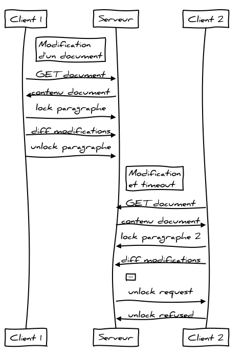

# CR Réunion 8 - Groupe 7-COMM - 15/04/13

## Organisation
Base de données :

- **Équipe** : Xiao Yu
- **Tâches**
  - Préparer une base de données stockant les données
  - Regarder les problèmes courants (joins), trouver 
  
*Back-end* :

- **Équipe** : Fabio, Paul
- **Tâches**
  - Réaliser un serveur capable de répondre aux requêtes client
  - Réaliser un serveur capable de communiquer avec la base de données
  - Mettre en place un protocole de communication
  
*Front-end* :

- **Équipe** : Guillaume, Baptiste
- **Tâches**
  - Lancer Yeoman
  - Faire les mockup en HTML
  - Utiliser des données bidon à injecter dans les vues HTML

## Documentation serveur

Structure d'un document :

	{
		id_: UUID,
		owner: "toto",
		collaborators: ["titi", "tata"],
		title: "Mon titre",
		content: [["Titre", 1], ["Sous-Titre", 2], "blabla", ["Sous-titre", 2], "blabla"]]
	}

Structure d'un utilisateur :
	
	{
		id_: UUID,
		name: "foo",
		password: "bar"
	}

## Réunion fin de phase I

### OSEO

#### Gestion risques

2 phases : PI/industrialisation. Gestion risques à séparer. Actuel : seulement phase croisière. Étudier risques liés à PI. Risques techniques, humains & organisationnels. p(phase 2 réussie) < 100%.

#### Finance

Chiffrage : jours plutôt qu'heures. Prix HT pour RH : enlever.

#### Publicité sur abonnements gratuits

Au mieux, s'autofinance. Bénéfices improbables => seuil de rentabilité infini. Hypothèse "pessimiste".

#### Abonnement entreprise

Tarification par utilisateur : pas forcément le meilleur choix, voir pack entreprise. Cependant, certains outils utilisent ce mode de fonctionnement par jetons. À l'année ou au mois ?

#### Relecture

Envoyer deadline aux relecteurs si nécessaire (si avancée pour raisons techniques)

### Init phase 2

PERT : mauvais alignement des boîtes, pas de légende (plein : sera implémenté, pointillé : ne le sera pas durant PI)

Recette : peut intégrer des parties optionnelles/indicateurs de flexibilité ou criticité. Dangereux de considérer que le projet est un échec si un point n'est pas validé. Généralement, recette faite plus tard (triche). Ajouter flexibilité. Ajouter quantificateurs plus précis que oui/non si possible. Détailler fonctions ? Séparer pure survie de fonctions innovantes. Trop plat, pas assez de hiérarchie dans les fonctions. Détailler performances, ergonomie, temps de réponse...

On est en recette fonctionnelle, ajouter recette technique avec perfs, nb max docs, archi, nb max d'users, taille max doc...

Serveurs : utiliser machines TC ? cf Frénot.

Ajouter gestion risques phase 2

