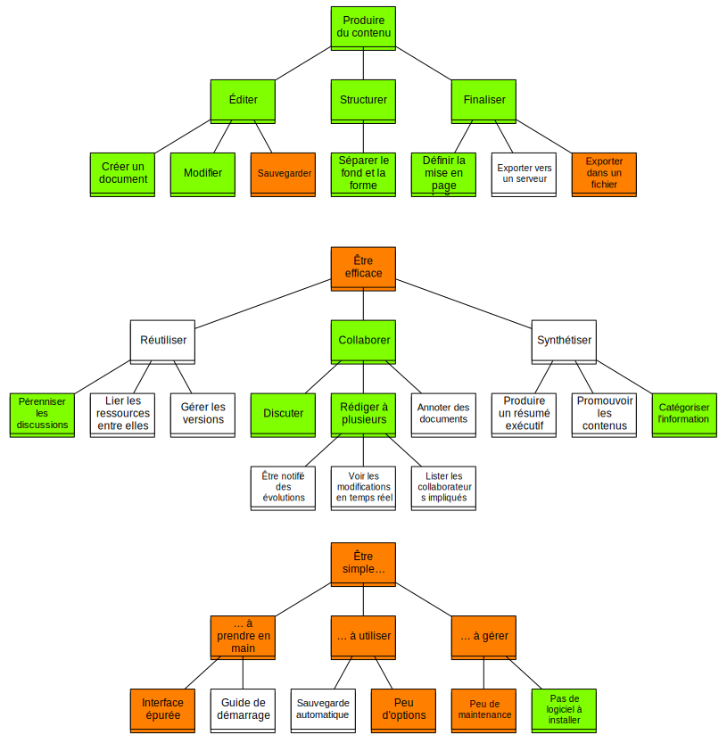

# Dossier d'initialisation de phase II

## Analyse fonctionnelle

Conformément à l'analyse effectuée dans le cahier OSEO, nous présentons ci-dessous le résultat de notre analyse fonctionnelle.

Sont représentées en vert les fonctions principales, en orange les fonctions contraintes et en blanc les fonctions optionnelles.

## Cahier de suivi
### Organisation de la phase II

Afin de garantir le bon déroulement du projet et la livraison des documents et du code en temps et en heure, nous avons établi un diagramme d'organisation pour la phase II du projet, que nous présentons ci-dessous.

### Feuille budgétaire

Dans cette section, nous listons l'ensemble des ressources nécessaires afin de réaliser notre prototype.

Nous réalisons une application web destinée à être accessible sur internet à nos clients *via* une offre *SaaS*. Il nous faut en conséquence un serveur permettant d'héberger notre application ainsi que ses données. Pour le prototype, nous nous orientons vers un serveur KS R-8G proposé par la société OVH.com, 3ème hébergeur mondial. Ce serveur sera largement suffisant pour mettre en place notre prototype, et son coût est de 29,99€ HT par mois. Nous prévoyons d'utiliser ce serveur pendant trois mois, pour un coût total de 89,97€.

D'autre part, notre produit est de manière inhérente une application temps réel, ce qui est un domaine complexe et difficile à appréhender. Afin de monter en compétences sur ce domaine, nous trouvons judicieux de participer à la *Realtime Conference 2013* qui se tiendra à Lyon les 22 et 23 avril 2013. Cet événement auquel participent des conférenciers d'entreprises prestigieuses et reconnues telles que Google, øMQ, Mozilla, Vodafone, etc. De plus, de nombreux représentants de logiciels libres sont présents, ce qui nous aidera dans nos choix techniques. Pour des raisons financières, nous prévoyons de n'envoyer que deux personnes à cette conférence, pour un coût total de 800€.

Au total, le coût de notre prototype revient à 889,97€.

### Éléments nécessaires pour entamer la seconde phase du projet

Entamer la phase II de notre projet du bon pied nécessite quelques ressources clés.

Tout d'abord, nous jugeons nécessaire de s'accorder sur l'interface que proposera notre produit. En effet, une interface claire et réfléchie est essentielle à une bonne expérience utilisateur. De plus, celle-ci doit être pensée au préalable afin d'éviter toute surprise ou désaccord au sein de l'équipe lors du développement du logiciel. Pour cela, nous prévoyons de réaliser un ensemble de *mockups* ou prototypes d'interface utilisateur, qui constitueront un livrable interne.

D'autre part, notre produit étant un logiciel utilisant de nombreux composants externes tels qu'une base de données et des bibliothèques, il est primordial d'effectuer les choix techniques en amont afin de constituer des fondations solides. Nous éviterons ainsi de perdre du temps. Pour nous assister dans ce choix, nous prévoyons d'envoyer deux membres de l'équipe à la *Realtime Conference* mentionnée plus haut.  Une fois ces choix techniques effectués, les différents membres présenterons leur décision à l'équipe. Une fois ces choix approuvés un livrable interne sera rédigé.

Enfin, il est crucial de mettre rapidement en place l'ensemble des outils sélectionnés précédemment et le serveur d'hébergement afin de garantir leur bon fonctionnement et une prise en main rapide par l'ensemble de l'équipe. Une phase d'initialisation est alors nécessaire, comme détaillé dans la section d'organisation de la phase II.

### Fiche de recette

Afin de vérifier le bon fonctionnement de notre prototype à la fin de la phase II, il est primordial de s'accorder sur des tests de recette. Ils garantissent la capacité de notre prototype à remplir un certain nombre de fonctions. Cette fiche de recette est détaillée ci-dessous.

<table>
	<thead>
		<th>Fonction</th>
		<th>Tests à réaliser</th>
		<th>Résultats</th>
	</thead>
	<tbody>
		<tr>
			<td>Gestion des utilisateurs</td>
			<td>
				<ul>
					<li>Le visiteur peut créer un nouveau compte</li>
					<li>Le visiteur peut se connecter avec son compte</li>
					<li>Une fois connecté, le visiteur a accès à des informations personnalisées</li>
					<li>L'utilisateur fait partie de groupes d'utilisateurs</li>
					<li>Le visiteur peut se déconnecter</li>
				</ul>
			</td>
			<td>
				<ul>
					<li>[ Oui / Non ]</li>
					<li>[ Oui / Non ]</li>
					<li>[ Oui : un panneau indiquant des notifications personnalisées / Oui : ses informations de profil uniquement / Non ]</li>
					<li>[ Oui : pas de limitations sur le nombre de groupes / Oui : 1 seul groupe par utilisateur / Non ]</li>
					<li>[ Oui / Non ]</li>
				</ul>
			</td>
		</tr>
		<tr>
			<td>Rédaction d'un document</td>
			<td>
				<ul>
					<li>L'utilisateur connecté peut créer un nouveau document vierge</li>
					<li>L'utilisateur connecté peut rédiger son document</li>
					<li>L'utilisateur connecté peut sauvegarder son document</li>
					<li>La rédaction d'un document sauvegardé peut être reprise plus tard</li>
					<li>Un document peut être catégorisé *via* des mots-clés.</li>
					<li>L'utilisateur peut rechercher les documents</li>
					<li>Le fond est séparé de la forme</li>
				</ul>
			</td>
			<td>
				<ul>
					<li>[ Oui / Non ]</li>
					<li>[ Oui / Non ]</li>
					<li>[ Oui : sauvegarde automatique / Oui : sauvegarde manuelle / Non ]</li>
					<li>[ Oui / Non ]</li>
					<li>[ Oui : autant de mots-clés que souhaités / Oui : 1 mot clé uniquement / Non ]</li>
					<li>[ Oui : recherche par mots-clés et titre / Oui : recherche par titre uniquement / Non ]</li>
					<li>[ Oui / Non ]</li>
				</ul>
			</td>
		</tr>
		<tr>
			<td>Relecture d'un document</td>
			<td>
				<ul>
					<li>L'utilisateur connecté peut visualiser un document sauvegardé</li>
					<li>L'utilisateur connecté peut exporter un document sauvegardé dans un fichier brut, proposé au téléchargement</li>
					<li>L'utilisateur connecté peut exporter un document sauvegardé dans un fichier avec mise en page, proposé au téléchargement</li>
				</ul>
			</td>
			<td>
				<ul>
					<li>[ Oui : en même temps que d'autres / Oui : 1 personne par document maximum / Non ]</li>
					<li>[ Oui / Non ]</li>
					<li>[ Oui / Non ]</li>
				</ul>
			</td>
		</tr>
		<tr>
			<td>Discussions</td>
			<td>
				<ul>
					<li>L'utilisateur connecté peut lancer une discussion à propos d'un document</li>
					<li>L'utilisateur connecté peut participer à une discussion</li>
					<li>L'utilisateur connecté peut commenter une partie précise d'un document</li>
					<li>Le système met en valeur les posts pertinents dans une discussion</li>
				</ul>
			</td>
			<td>
				<ul>
					<li>[ Oui / Non ]</li>
					<li>[ Oui / Non ]</li>
					<li>[ Oui : granularité de la lettre / Oui : granularité de la ligne / Oui : granularité du paragraphe / Non ]</li>
					<li>[ Oui : selon un algorithme complexe / Oui : selon le nombre de commentaires associés / Non ]</li>
				</ul>
			</td>
		</tr>
	</tobdy>
</table>
