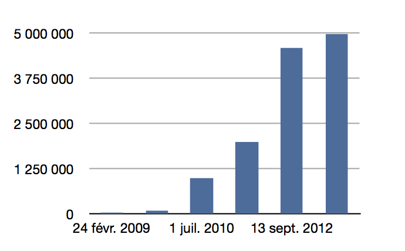
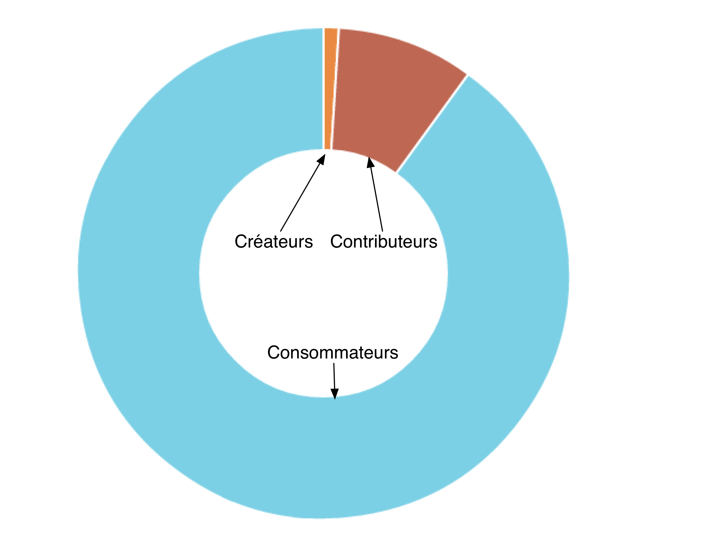

# Etude du marché 

Le monde d'aujourd'hui est de plus en plus marqué par l'évolution des méthodes de travail résultant de l'essort des technologies. Un bon travail d'équipe est devenu essentiel pour surmonter la concurrence planétaire. D'où l'apparition en masse d'outils  de travail collaboratifs. Ces outils visent essentiellement à améliorer la communication au sein d'un groupe de travail. De nos jours, l'homme à besoin de la technologie pour l'aider à partager du savoir et en recueillir. Internet a jouer un rôle majeur dans la création et diffusion de données et les possibilités qu'il offre sont variés : blogs, wikis, site web...

Avant de se lancer dans le monde des outils de collaboration, une définition sur le travail en groupe s'impose. Un **travail collaboratif** peut se définir ainsi (*wikipédia* et *internaute*) : Mode de travail non hiérarchisé dans lequel des personnes mettent en commun leur créativité et leurs compétences afin d'atteindre un objectif commun. Aujourd'hui cela est possible grâce aux technologies de l'information et de la communication. Les outils nouveaux permettent de maximiser la créativité et l'efficience d'un groupe associé à des projets d’envergure même si elles sont très dispersées dans l'espace et le temps. Les domaines suivants font un appel important à de tel outils :

1. Environnement bureautique : afin de mieux partager l'information.
2. Gestion documentaire : pour harmoniser la gestion des différentes versions de documents.
3. Gestion de projet : pour manager le déroulement d'un projet.	
4. Gestion des relations sociales : pour valoriser les relations entre collaborateurs et avec l’externe.
5. Gestion des connaissances : pour capitaliser sur les savoirs.

## Comportements

Chaque utilisateur du Web utilise aujourd'hui des outils de travail collaboratifs divers et variés. Certains proposent un moyen direct de communication : téléphones, messageries instantannées, vidéo conférence... Et d'autres moyens eux sont asynchrone : email, sms, posts, forums... Les entreprises d'aujourd'hui utilise presque tous un intranet. Pour le travail collaboratif sur un même produit étant amené à évoluer fortement au cours du temps, on observe l'utilisation d'outils permettant le versionning et le partage de document. 
Il est également interressant de noter que certains outils qui n'était au départ pas réellement destinés à faciliter le travail collaboratifs ont évolué vers dans cette directive. Facebook par exemple est devenu un organisateur d'événement. Voyons plus en détails les grandes catégories d'outils de travail en collaborations :

### Gestionnaires de versionning et outils de partage de document :

Ils sont en place sur le marché depuis quelques années déjà, mais leurs ouverture au grand public est plus rescente. Dropbox en est un des exemples car il a su s'imposer chez l'utilisateur lambda en démysthifiant les complicités du partage. Comme le blog de l'entreprise l'indique, cet outil à rencontrer du succès chez les professionels avec plus de 2 millions d'entreprises à leurs actif et chez les particuliers avec plus 50 millons de comptes ouverts depuis 2007.

On pourra également noter que l'aspect social apparait dans les outils Github ou Microsoft Sharepoint, avec une page de profil présentant rapidement qui vous êtes et les projets auquel vous avez contribué. 

De tels outils rencontre un succès fulgurant, comme le montre le graphique suivant représentant l'évolution du nombre de dépôt Github de dernières années :

### Editeur collaboratifs :

Ces outils se concentre sur l'édition de document à plusieurs visant à partager des savoirs et capitaliser sur ces derniers. On distingue deux catégories d'outils.
* Les outils à temps réel tel que GoogleDocs et EtherPad sont de plus en plus utilisé au sein des entreprises. 
* Les outils asynchrones tel que Wikipédia qui compte 18.5 millions d'utilisateurs aujourd'hui et qui a permis de générer environ 29 millions de pages wiki en travail collaboratif. 

Balancer le sondage ici ???

### nouveau concepts émergents :

Il est également intéressant de remarquer l'émergence de nouveau concept de collaboration qui souligne bien l'émergence du travail collaboratif. Le "coworking", par exemple est un nouveau terme désignant des  un type d'organisation du travail qui regroupe deux notions : un espace de travail partagé, mais aussi un réseau de travailleurs encourageant l'échange et l'ouverture. Similaire au communément nommé "cafés philos", ces espaces public de travail sont de plus en plus nombreux à apparaitre dans les grandes ville du monde. Quand à elle la notion de "Crowndsourcing" désigne une pratique consistant à réunir un grand groupe de personne intéréssé par un même sujet dans le but de trouver une solution à un problème.

## Acteurs

Cette partie est consacré aux acteurs que nous cherchons à viser avec notre produit. Nous nous recentrons donc sur l'édition collaborative de document.

### Qui sont les acheteurs et les consommateurs ?

Aujourd'hui, le besoin de rédiger à plusieurs est essentiel au sein d'une entreprise. Les échanges doivent être rapide, simple et éfficasse. Un système d'étition en temps réel est donc essentiel. Notre proposition de suivi de la création d'un document répond également au besoin d'une entreprise car elle permet de mieux suivre et voir les points critiques soulevé lors du travail de groupe. De plus, la communication interne par messagerie instantanée amène parfois à des discussions intéréssantes où la pérénisation de l'échange et son partage sont crucial pour la rentabilité. Pouvoir passer de discussions instantannés, à forums puis à document texte nous semble répondre à un besoin des entreprises qui sont aujourd'hui trop envahi par des outils trop variés et contraignant. Pouvoir communiquer et travailler sur le même outil est essentiel. Avec son objectif "Zero-mail", l'entreprise Atos montre son désir de révision des outils de collaborations actuels. Les entreprises nous semble donc être nos achteurs potentiel numéro 1. Cependant, de part notre expèrience en tant qu'étudiant et nos connaissant dans la vie associative nous nous sommes rendu compte qu'un tel outils pourrait également intérésser à la fois les universités et les milieux associatifs. Enfin, notre produit pourrait également être utile à n'importe quel utilisateur lambda désireux de rédiger un document sur un thème précis. Alors, une communoté de personnes porté par ce même thème pourrait lui venir en aide. 

### Qui sont les concurrents ?

Tous les éditueurs de texte collaboratifs sont des concurrent potentiels. Pour ne citer que les plus connu : "GoogleDocs", "Wikipédia" et "Etherpad" travail sur un marché similaire. De plus les réseaux sociaux sont également des concurrents potentiels, tout comme : "Facebook","LinkIn","Google+"...
Cependant, nous ne prétendons pas re-créer un "GoogleDocs" ou un "Facebook", mais simplement créer un outil répondant au besoin des acteurs mentionné si dessus.

##  Opportunités de lancement 

Evidemment les outils d'aujourd'hui ont fortement améliorer les méthodes de travai collaboratives et permis de grandes avancé en termes d'efficasité. Messagerie électronique, élaboration de documents sur google docs, vidéo conférence... Tout ces outils sont appréciés. Cependant, il semblerait qu'ils y ai un manque de cohérence et practicité entre ces derniers. Support trop variés, nombre d'email excessif... Il faudrait être constamment sur sa messagerie électronique, Facebook et twitter tout en ayant son téléphone en poche ! Une cohésion s'impose. Par exemple, imaginons qu'un employé travaillant en home-office est eu un problème technique quelconque qui l'a ammené à demandé de l'aide à son chef par messagerie instantanné. Le lendemain, deux autres membres de son équipe ont le même problème et leur chef se retrouve à leurs expliquer à nouveau un par un comment résoudre leur problème. Il aurait été tellement plus simple de péréniser ma discussion en ligne de la veille sous la forme d'un forum et la partager...

De nos jours l'email montre ses limites. Les boites mails explosent. Les conversations qui ne nous concerne plus continue parfois de nous spammer pendant longtemps. Notre outil, permetrait non seulment de limiter se nombre de mails mais aussi de décider de ne plus suivre la production d'un document qui ne nous intéresse plus.

De plus, un des problème majeur sur la toile est la quantité faramineuse d'information dont la validité est difficile à évaluer. Quel importance peut t-on accorder à tel que les pages de wikis créer sur wikipédia. Les pages étant non signé, personne ne prend réellement la responsabilité de validé la validité du document. Notre outil permettera aux gens de commenter des documents en ligne sur un sujet qui connaisent mais l'éditeur pourra rester si il le souhaite dans l'entière possession  de ses droits sur le document. Un document signé engage une personne, cela permet révéler plus efficassement les origines des informations sur la toile. Toujours, dans cette problématique de comment faire resortir les informations de valeurs, nous remarquerons qu'un post Twitter ou Facebook et voué à disparaitre en "bas du mur" tôt ou tard, et ce qu'elle que soit ça valeur. Des personnes communiquant par mails ou messageries instantannées peuvent soulever des informations qui pourrait éventuellement être utiles à d'autres, mais comment les pérénisser ? Les partager ?

Dans la culture de l'internet on parle de la loi des 1 pourcent ou du principe 90-9-1 qui gouverne l'apport d'information sur la toile. Celle-ci stipule que seulement 1 pourcent des utilisateurs du web y crée de l'information, 9 pourcents contribuent de par leur remarques et commentaires à la bonification de cette information crée et que les 90 restant ne font que profiter de l'information crée mais sans en créer au même. Notre outil aurait pour but de donner plus de pouvoir aux créateurs et de faciliter la contribution afin de ammené les personnes à créer plus et mieux ensemble ! 

On parle également aujourd'hui du "Web 3.0" ou le "Web sémantique" dont le but principal viserait à orienter l'évolution du Web pour permettre aux utilisateurs sans intermédiaires de trouver, partager et combiner l'information plus facilement." C'est dans cette direction que notre outil veut servir ses utilisateurs.

## Brouillons , voir si mettre ou non...

### Quelles sont les contraintes de mon marché et les clefs de succès ?

### Y-a-t-il, oui ou non, une opportunité pour que mon projet réussisse ?
#### Oui
* **Enjeux de la gestion de la connaissance** : http://fr.wikipedia.org/wiki/Management_de_la_connaissance#Enjeux_de_la_gestion_de_la_connaissance
* resultat **sondage**
* mail Atos 

#### Non
* Beaucoup de conccurents potentiels
* Migration sur notre outils pouvant être difficile

##  Faire les meilleurs choix pour atteindre ses objectifs
* **trois facteurs interrésant** : la proximité, l'intimité et la permissivité. Le facteur de la proximité doit rapprocher les individus. L'intimité leur permet de rester maîtres de leur accessibilité aux autres. Enfin, la permissivité (permission, en anglais) signifie que la possibilité d'interagir en dehors de relations de travail structurées est non seulement permise, mais encouragée (  Anne-Laure Fayard et John Weeks, de Harvard )
* **rejoint la stratégie marketing**

