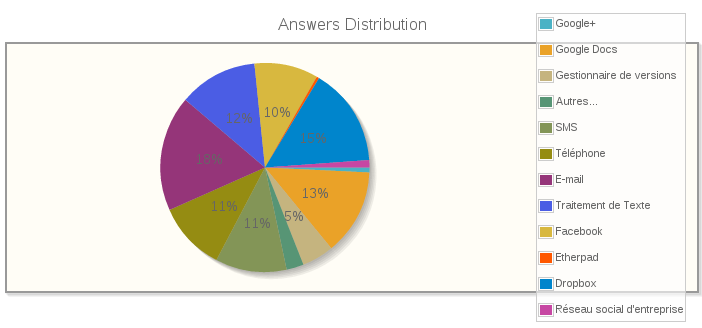
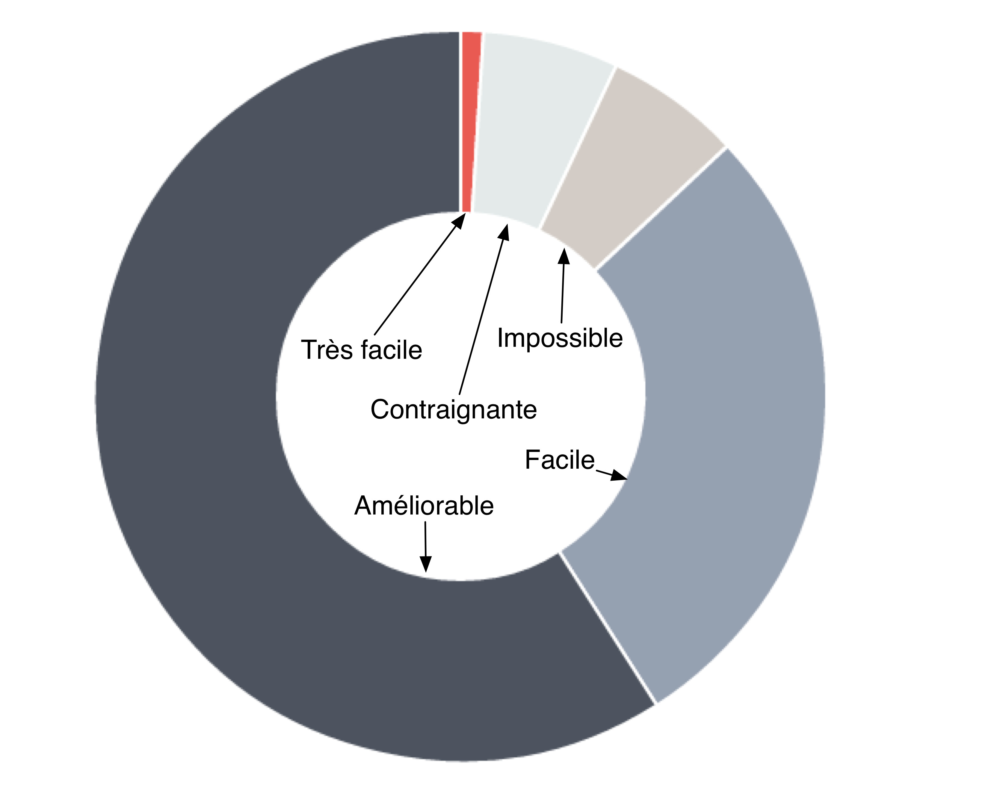
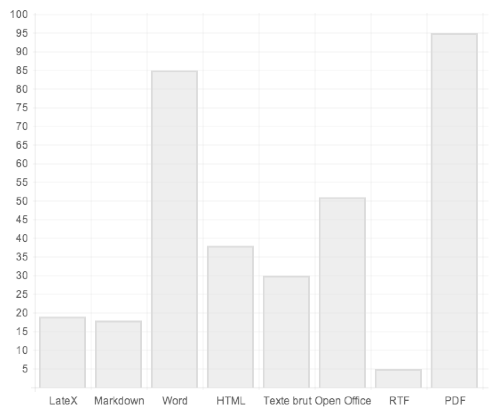

# Etude du marché 

Le monde d'aujourd'hui est de plus en plus marqué par l'évolution des méthodes de travail résultant de l'essor des technologies. Cette évolution tend à mener vers un travail de plus en plus collaboratif. Le travailleur solitaire n'a plus sa place dans le monde globalisé qui est le nôtre. Un bon travail d'équipe est devenu essentiel pour surmonter la concurrence planétaire, d'où l'apparition de nombreux outils de travail collaboratif. Ces outils visent à améliorer la communication au sein d'un groupe de travail. 

De par nature l'homme transmet ce qu'il sait en le communiquant. De nos jours, il utilise la technologie afin non seulement de partager son savoir mais également de le pérenniser et de l'enrichir par une mise en commun des connaissances mondiales. 

Le **travail collaboratif** peut être défini comme un mode de travail non hiérarchisé dans lequel des personnes mettent en commun leur créativité et leurs compétences afin d'atteindre un même objectif. Aujourd'hui, les travaux en collaboration s'appuient de plus en plus sur les technologies de l'information et de la communication. Les nouveaux outils permettent d'optimiser l'efficacité d'un groupe de personnes travaillant ensemble sur des projets même si elles sont très dispersées dans l'espace et le temps. Les domaines suivants nécessitent fortement de tels outils.

 * Gestion documentaire : pour harmoniser le travail sur différentes versions de documents
 * Gestion de projet : pour manager le déroulement d'un projet	
 * Gestion des relations sociales : pour valoriser les relations internes et externes à une organisation
 * Gestion des connaissances : pour capitaliser les savoirs et mieux partager les informations

## Comportements du marché

Chaque utilisateur du Web utilise aujourd'hui des outils de travail collaboratif divers et variés. Certains proposent un moyen direct de communication : par téléphone, par messagerie instantanée, par vidéo conférence... D'autres moyens sont eux asynchrones : e-mail, SMS, forums... Selon l'INSEE, 45% des sociétés françaises étaient dotées d'un intranet début 2010. De plus, concernant le travail collaboratif sur un même produit amené à beaucoup évoluer dans le temps, on remarque l'utilisation d'outils permettant le versioning et le partage de documents. Il est également intéressant de noter que certains outils qui à l'origine n'étaient pas destinés à faciliter le travail collaboratif ont évolué en ce sens. Par exemple, Facebook est devenu un organisateur d'événement.

Un sondage réalisé auprès de 113 personnes nous a permis de mettre en évidence la grande variété d'outils utilisé pour les travaux collaboratifs.

Ce résultat montre la diversité des outils.  Il resort que l'e-mail, DropBox et GoogleDocs constitue parmi les moyens de collaborer principaux. 

Nous analysons maintenant les grandes catégories d'outils de travail en collaboration.

### Gestionnaires de versionning et outils de partage de documents

Ils sont en place sur le marché depuis quelques années déjà, mais leur ouverture au grand public est plus récente. Dropbox est un des exemples les plus connus car il a su s'imposer dans les entreprises, mais également chez l'utilisateur *lambda* en démystifiant la complexité inhérente au partage. Comme le blog de Dropbox l'indique, cet outil est utilisé par les professionels de plus de 2 millions d'entreprises et par les particuliers avec plus de 50 millons de comptes ouverts depuis 2007.

On pourra également noter que l'aspect social a pris de l'importance. Par exemple, Github et Microsoft Sharepoint proposent une page de profil présentant rapidement l'identité de l'utilisateur et les projets auxquels il a contribué. L'interaction entre les divers utilisateurs est de plus en plus mise en avant afin de les rapprocher en raison d'un intérêt commun.

Le succès rencontré est fulgurant, comme le montre le graphique suivant représentant l'évolution du nombre de dépôts Github au cours de ces dernières années :

### Éditeurs collaboratifs

Ces outils se concentrent sur l'édition de documents en groupe visant à partager des savoirs et capitaliser sur ces derniers. On distingue deux catégories d'outils :

* Les outils fonctionnant en temps réel tels que GoogleDocs et EtherPad, qui sont de plus en plus utilisés par les entreprises
* Les outils asynchrones, comme Wikipédia qui compte aujourd'hui 18,5 millions d'utilisateurs et qui a permis de générer environ 29 millions de pages wiki en travail collaboratif

Les 3 noms d'outils mentionnés ci-dessus constitue nos principaux concurrents. Cependant, notre sondage a mis en évidence le désir d'une amélioration dans ce domaine.

*Avec les outils actuels, vous estimez que l'édition collaborative de documents est :*

*Seriez-vous intéressé par un nouvel outil permettant de faciliter la rédaction de documents en groupe ?*

Nous avons également profiter de ce sondage pour mettre en évidence les formats d'exportation les plus attendu par le public.

### Nouveaux concepts émergents

Il est également intéressant de remarquer l'émergence de nouveaux modes de collaboration, qui soulignent bien notre entrée dans l'ère du travail à plusieurs. Le *coworking*, par exemple, est un nouveau terme désignant un type d'organisation du travail qui regroupe deux notions : un espace de travail partagé, mais aussi un réseau de travailleurs encourageant l'échange et l'ouverture. Similaires aux *cafés philos*, ces espaces publics de travail sont de plus en plus nombreux à apparaître dans les grandes villes du monde. La notion de *crowdsourcing* désigne quant à elle une pratique consistant à réunir un grand groupe de personnes intéréssées par un même sujet dans acteurs avec planle but de trouver une solution à un problème.

##  Opportunités de lancement

### Points sensibles 

Comme montré ci-dessus, il y a beaucoup de concurents potentiels et ils sont d'envergures. De plus, la migration sur notre outil peut être difficile pour les sociétés dont les employés peuvent être réfractaire au changement. Enfin, notre outil, tout comme une communauté, prend d'autant plus de valeur que son nombre d'utilisateur est grand. Le décollage de ce dernier peut donc être un peu fastidieux au départ.

### Points forts

Pouvoir péréniser les discussions et utilisé différents support sur un même outil est une idée innovante qui, suite à notre étude de marché, nous semble répondre à un besoin réel. Notre objectif est de faire resortir les informations de valeur, ce qui est un point crucial pour le monde actuel. 

On parle également aujourd'hui du "Web 3.0" ou du "Web sémantique" dont le but principal viserait à orienter l'évolution du Web pour permettre aux utilisateurs sans intermédiaires de trouver, partager et combiner l'information plus facilement. C'est dans cette direction que notre outil veut servir ses utilisateurs.

Dans la culture de l'internet on parle de la "loi des 1 pourcent" ou du "principe 90-9-1" qui gouverne l'apport d'informations sur la toile. Celle-ci stipule que seul 1 pourcent des utilisateurs du web contribuent à créer de l'information, 9 pourcents contribuent par leurs remarques et leurs commentaires à la bonnification de cette information et que les 90 restants ne font que profiter de l'information créée mais sans en créer eux même. Notre outil aurait pour but de donner plus de pouvoir aux créateurs et de faciliter la contribution à la création d'information en ligne afin d'amener les personnes à mieux et plus produire ensemble ! 

