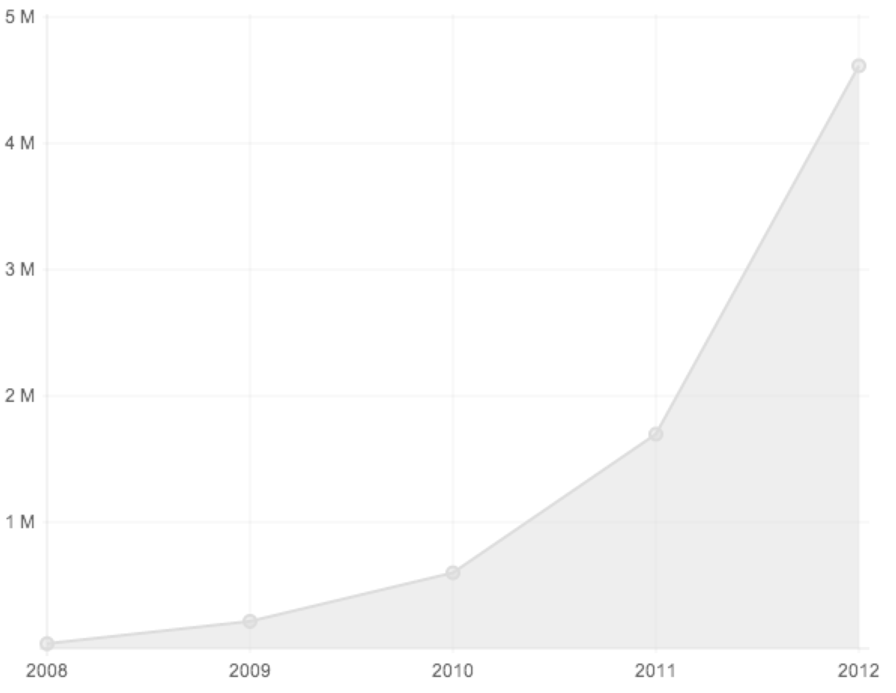

# Etude du marché 

Le monde d'aujourd'hui est de plus en plus marqué par l'évolution des méthodes de travail résultant de l'essort des technologies. Un bon travail d'équipe est devenu essentiel pour surmonter la concurrence planétaire. D'où l'apparition de nombreux outils de travail collaboratif. Ces outils visent essentiellement à améliorer la communication au sein d'un groupe de travail. De nos jours, l'homme a besoin de la technologie pour l'aider à partager et reccueillir du savoir. Internet a joué un rôle majeur dans la création et la diffusion de données et les possibilités qu'il offre sont variées : blogs, wikis, sites webs...

Avant de se lancer dans le monde des outils de collaboration, il est nécessaire de définir le travail en groupe. Un **travail collaboratif** peut se définir ainsi (*wikipédia* et *internaute*) : Mode de travail non hiérarchisé dans lequel des personnes mettent en commun leur créativité et leurs compétences afin d'atteindre un même objectif. Aujourd'hui, les travaux en collaboration s'appuient de plus en plus sur les technologies de l'information et de la communication. Les nouveaux outils permettent d'optimiser la créativité et l'efficacité d'un groupe de personnes travaillant ensemble sur des projets même si elles sont très dispersées dans l'espace et le temps. Les domaines suivants nécessitent fortement de tels outils :

1. Gestion documentaire : pour harmoniser le travail sur différentes versions de documents.
2. Gestion de projet : pour manager le déroulement d'un projet.	
3. Gestion des relations sociales : pour valoriser les relations internes et externes à une organisation.
4. Gestion des connaissances : pour capitaliser les savoirs et mieux partager les informations.

## Comportements

Chaque utilisateur du Web utilise aujourd'hui des outils de travail collaboratif divers et variés. Certains proposent un moyen direct de communication : par téléphone, par messagerie instantannée, par vidéo conférence... Et d'autres moyens eux sont asynchrones : email, sms, posts, forums... Les entreprises d'aujourd'hui utilisent presque toutes un intranet. Pour le travail collaboratif sur un même produit amené à beaucoup évoluer dans le temps, on remarque l'utilisation d'outils permettant le versionning et le partage de documents. 
Il est également intéressant de noter que certains outils qui à l'origine n'étaient pas destinés à faciliter le travail collaboratif ont évolué en ce sens. Par exemple, Facebook est devenu un organisateur d'événement.

Voyons plus en détails les grandes catégories d'outils de travail en collaboration :

### Gestionnaires de versionning et outils de partage de documents :

Ils sont en place sur le marché depuis quelques années déjà, mais leurs ouverture au grand public est plus récente. Dropbox en est un des exemples les plus connus car il a su s'imposer dans les entreprise, mais également chez l'utilisateur lambda en démysthifiant les complexités du partage. Comme le blog de Dropbox l'indique, cet outil est utilisé par les professionels de plus de 2 millions d'entreprises et par les particuliers avec plus de 50 millons de comptes ouverts depuis 2007.

On pourra également noter que l'aspect social a pris de l'importance. Par exemple, Github et Microsoft Sharepoint proposent une page de profil présentant rapidement l'identité de l'utilisateur et les projets auxquels il a contribué. L'interaction entre les divers utilisateurs est de plus en plus mise en avant afin de les rapprocher en raison d'un intérêt commun.

Le succès rencontré est fulgurant, comme le montre le graphique suivant représentant l'évolution du nombre de dépôts Github au cours de ces dernières années :

### Editeur collaboratifs :

Ces outils se concentrent sur l'édition de documents en groupe visant à partager des savoirs et capitaliser ces derniers. On distingue deux catégories d'outils.
* Les outils fonctionnant en temps réel tels que GoogleDocs et EtherPad sont de plus en plus utilisés par les entreprises. 
* Les outils asynchrones comme Wikipédia qui compte aujourd'hui 18.5 millions d'utilisateurs et qui a permis de générer environ 29 millions de pages wiki en travail collaboratif.

Ces outils sont particulièrement utilent dans les milieux professionels et étudiants.

Balancer le sondage ici ???

### Nouveaux concepts émergents :

Il est également intéressant de remarquer l'émergence de nouvelles manières originales de collaborer qui soulignent bien notre entrée dans l'ère du travail à plusieurs. Le "coworking", par exemple est un nouveau terme désignant un type d'organisation du travail qui regroupe deux notions : un espace de travail partagé, mais aussi un réseau de travailleurs encourageant l'échange et l'ouverture. Similaire au communément nommé "cafés philos", ces espaces publics de travail sont de plus en plus nombreux à apparaitre dans les grandes villes du monde. Quand à elle la notion de "Crowndsourcing" désigne une pratique consistant à réunir un grand groupe de personnes intéréssées par un même sujet dans le but de trouver une solution à un problème.

## Acteurs

Cette partie est consacrée aux acteurs que nous cherchons à toucher à l'aide de notre produit. Nous nous recentrons donc sur l'édition collaborative de documents.

### Qui sont les acheteurs et les consommateurs ?

Aujourd'hui, le besoin de rédiger à plusieurs est essentiel au sein d'une entreprise. Les échanges doivent être rapides, simples et efficaces. Un système d'étition en temps réel est donc essentiel. Notre proposition de suivi de la création d'un document répond également au besoin des entreprises car elle permet de mieux suivre et de mieux voir les points critiques soulevés dans le cadre d'un travail de groupe. De plus, la communication interne par messagerie instantanée amène parfois à des discussions intéressantes où la pérénisation de l'échange et son partage sont cruciaux pour la rentabilité. La possibilité de passer de discussions instantannés à des forums puis à des documents textes nous semble répondre à un besoin des entreprises qui sont aujourd'hui trop envahies par des outils excessivement variés et contraignants. Communiquer et travailler sur le même outil est essentiel. Avec l'objectif "Zero-mail"de l'entreprise Atos, celle-ci montre un désir d'amélioration des outils de collaboration actuels. Les entreprises nous semblent donc être nos acheteurs potentiels principaux. De plus, du fait de notre expèrience en tant qu'étudiants et nos connaissances de la vie associative nous nous sommes aperçus qu'un tel outil pourrait également intéresser à la fois les universités et les milieux associatifs. Enfin, notre produit pourrait également être utile à n'importe quel utilisateur désireux de rédiger un document sur un thème précis. Ainsi, une communauté de personnes intéressées par un thème commun pourrait lui venir en aide. 

### Qui sont les concurrents possibles ?

Tous les éditeurs de textes collaboratifs sont des concurrents potentiels. Pour ne citer que les plus connus : "GoogleDocs", "Wikipédia", "Etherpad"(...) travaillent sur un marché similaire. De plus les réseaux sociaux sont également des concurrents potentiels, tout comme : "Facebook","LinkIn","Google+"...
Cependant, nous ne prétendons pas réinventer un "GoogleDocs" ou un "Facebook", mais simplement créer un outil répondant au besoin des acteurs mentionnés ci-dessus.

##  Opportunités de lancement 

Evidemment les outils d'aujourd'hui ont fortement amélioré les méthodes collaboratives de travail et permis de grandes avancées en terme d'efficacité. Messagerie électronique, élaboration de documents sur google docs, vidéo conférence... Tout ces outils sont appréciés. Cependant, il semblerait qu'il y ait un manque de cohérence et praticité entre ces derniers : supports trop variés, nombre excessif d'emails... Il faudrait constamment être sur sa messagerie électronique, Facebook et Twitter tout en ayant son téléphone en poche pour pouvoir travailler! Une cohésion entre tous ses éléments s'impose. Par exemple, imaginons qu'un employé travaillant en home-office ait eu un problème technique quelconque qui l'a ammené à demander de l'aide à son chef par messagerie instantannée. Le lendemain, deux autres membres de son équipe ont le même problème et leur chef se retrouve à leurs expliquer à nouveau un par un comment le résoudre. Il aurait été tellement plus simple de péréniser la discussion de la veille en ligne sous la forme d'un forum et la partager...

De nos jours l'email montre ses limites. Les boites mails explosent. Les conversations qui ne nous concernent plus continuent parfois de nous spammer pendant longtemps. Notre outil, permettrait non seulement de limiter le nombre de mails mais aussi de décider de ne plus suivre la production d'un document qui ne nous intéresse plus.

De plus, un des problème majeur sur la toile est la quantité faramineuse d'informations dont la validité est difficile à évaluer. Quelle importance peut t-on accorder à des pages sur wikipédia. Ces pages n'étant pas signées, personne ne prend réellement la responsabilité d'attester de la crédibilité du document. Notre outil permettra aux gens de commenter des documents en ligne sur un sujet qu'ils connaissent mais l'éditeur pourra rester, s'il le souhaite, en possession de ses droits sur le document. Un document signé engage une personne, cela permet de révéler plus efficacement les origines des informations sur la toile. Toujours, dans cette problématique visant à faire resortir les informations de valeur, nous remarquerons qu'un post Twitter ou Facebook est voué à disparaitre en "bas du mur" tôt ou tard, et ce quelle que soit sa valeur. Des personnes qui communiquent par mail ou messagerie instantannée peuvent soulever des informations qui pourraient éventuellement être utiles à d'autres, mais comment les pérénisser ou les partager ?

Dans la culture de l'internet on parle de la "loi des 1 pourcent" ou du "principe 90-9-1" qui gouverne l'apport d'informations sur la toile. Celle-ci stipule que seul 1 pourcent des utilisateurs du web contribuent à créer de l'information, 9 pourcents contribuent par leurs remarques et leurs commentaires à la bonnification de cette information et que les 90 restants ne font que profiter de l'information créée mais sans en créer eux même. Notre outil aurait pour but de donner plus de pouvoir aux créateurs et de faciliter la contribution à la création d'information en ligne afin d'amener les personnes à mieux et plus produire ensemble ! 

On parle également aujourd'hui du "Web 3.0" ou le "Web sémantique" dont le but principal viserait à orienter l'évolution du Web pour permettre aux utilisateurs sans intermédiaires de trouver, partager et combiner l'information plus facilement. C'est dans cette direction que notre outil veut servir ses utilisateurs.

## Brouillons , voir si mettre ou non...

### Quelles sont les contraintes de mon marché et les clefs de succès ?

### Y-a-t-il, oui ou non, une opportunité pour que mon projet réussisse ?
#### Oui
* **Enjeux de la gestion de la connaissance** : http://fr.wikipedia.org/wiki/Management_de_la_connaissance#Enjeux_de_la_gestion_de_la_connaissance
* resultat **sondage**
* mail Atos 

#### Non
* Beaucoup de conccurents potentiels
* Migration sur notre outils pouvant être difficile

##  Faire les meilleurs choix pour atteindre ses objectifs
* **trois facteurs interrésant** : la proximité, l'intimité et la permissivité. Le facteur de la proximité doit rapprocher les individus. L'intimité leur permet de rester maîtres de leur accessibilité aux autres. Enfin, la permissivité (permission, en anglais) signifie que la possibilité d'interagir en dehors de relations de travail structurées est non seulement permise, mais encouragée (  Anne-Laure Fayard et John Weeks, de Harvard )
* **rejoint la stratégie marketing**

