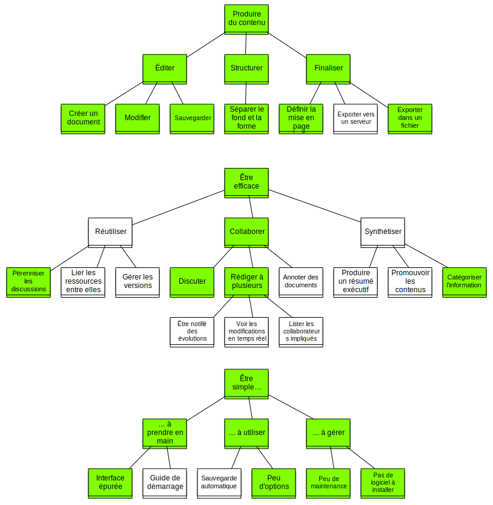

# Analyse des besoins

## Problématique

Notre projet cherche à apporter une solution au problème de l'édition collaborative de documents. Il existe en effet peu d'outils, à l'heure actuelle, permettant à plusieurs rédacteurs de produire efficacement un document de bout en bout, c'est-à-dire du brouillon à la version imprimable. Dans la majorité des cas, l'e-mail est utilisé de manière exhaustive, soit pour échanger des idées, soit pour faire circuler des fragments de document ou des versions différentes du document complet. Cette approche présente un certain nombre de problèmes qui rendent la tâche pénible et limitent fortement la productivité.

En premier lieu, l'e-mail n'a pas été conçu pour être utilisé comme outil de conversation au sein d'un groupe. Il s'agit d'un moyen de communication asynchrone, si bien que les délais entre une question et une réponse dans une conversation par mail se mesurent le plus souvent en heures. De plus, les *mailing lists* génèrent des volumes de mails ingérables pour garantir que toute l'information soit à disposition de tous les participants : si une conversation entre deux personnes se développe, les autres membres de la liste reçoivent tous les mails échangés, alors même qu'ils ne sont pas concernés. Cependant, renoncer à les utiliser risque de conduire à une exclusion involontaire de certains membres.

Par ailleurs, l'utilisation de la pièce jointe pour transporter des fichiers de texte riche soulève de nouvelles difficultés. D'une part, le contrôle de version est impossible, si bien que la dernière version des différentes parties du document a de fortes chances de se trouver dispersée dans plusieurs fichiers, du fait que les différents rédacteurs travaillent sur des fichiers différents. D'autre part, des problèmes de format peuvent ralentir considérablement la mise en commun de diverses parties d'un document. Si la compatibilité entre les formats de Microsoft Office et LibreOffice est presque totale, il n'en demeure pas moins que tenter de réunir des paragraphes possédant une mise en page différente, des marges différentes, des polices de caractère différentes (les ensembles des typographies Windows et Linux sont pratiquement disjoints) et éventuellement des titres ou listes à puces automatiques est une tâche longue, difficile et ingrate.

## Limitations des outils disponibles

Bien entendu, des outils alternatifs et mieux adaptés existent depuis longtemps pour répondre à ces problèmes ; toutefois, ils le font le plus souvent à titre individuel. Ainsi, les forums ou les messageries instantanées sont plus adaptées pour l'échange d'idées et la discussion, les services de dépôt de fichiers comme Github ou SVN gèrent efficacement le partage de fichiers en général et le versionnage, mais sont orientés davantage vers l'édition de code et sont difficiles d'utilisation ; en pratique, ils ne sont pas adaptés à la rédaction collaborative. À défaut de système unifié, le seul remplacement valable pour l'e-mail serait une série d'outils différents sans aucun lien entre eux. Une telle solution est peu attractive et ajoute également au processus d'édition des lourdeurs liées à l'apprentissage et à l'usage de plusieurs technologies en parallèle.

Toutefois, le besoin de convergence entre éditeurs de documents et outils de discussion s'est déjà fait sentir, et plusieurs solutions ont été proposées. Nous pouvons citer, parmi les plus populaires, Google Docs et EtherPad. Le premier fonctionne uniquement dans un navigateur Web et propose une gestion de versions, des fonctionnalités de mise en page avancées et un système de commentaires permettant d'annoter un document en cours de rédaction. Le second utilise un client installé sur la machine et propose un système d'édition basique et un espace de discussion instantanée. Il en existe également des versions utilisable directement dans le navigateur.

De tels outils apportent des solutions à certains problèmes, mais ne sont pas assez complets pour faire disparaître l'e-mail de la chaîne de production. Google Docs ne possède pas de plateforme de discussion, bien qu'il propose un puissant système d'édition et des fonctionnalités d'annotation. EtherPad, quant à lui, ne propose aucune pérennisation des échanges instantanés et demeure un éditeur assez pauvre ; en particulier, il ne peut pas exporter un document et ne gère pas les droits d'accès : n'importe qui possédant l'URL du document peut le lire et l'éditer. Aucun logiciel ne propose actuellement la convergence entre discussion instantanée, nécessaire pour sa rapidité, et messagerie "asynchrone" de type forum, indispensable pour sauvegarder le contenu important de la conversation.

Enfin, l'immense majorité des éditeurs actuels est basés sur le paradigme WYSIWYG (What You See Is What You Get), c'est-à-dire sur l'apparence du document plutôt que sur sa structure. Le problème de ces éditeurs est la tentation pour la plupart des utilisateurs de ne pas utiliser de styles, ce qui rend l'intégration de plusieurs parties de document écrites par des rédacteurs différents extrêmement pénible. Pour assurer une meilleure interopérabilité, un système de rédaction basé sur la structure (WYSIWYM, What You See Is What You Mean) est préférable : l'utilisateur est forcé de décrire le document de manière structurelle, ce qui supprime automatiquement ce travers. Les langages les plus répandus utilisant ce paradigme sont LaTeX et Markdown.

L'approche structurelle de l'écriture de documents présente deux avantages, dont le premier est la cohérence des documents. Une entreprise peut sans aucune difficulté donner un aspect unifié à tous les documents produits sur notre plateforme. D'autre part, les rédacteurs n'ont pas à prendre en compte l'utilisation et l'unification des styles, qui sont totalement automatisées. En conséquence, cette approche augmente la productivité en leur permettant de se concentrer sur le contenu du document plutôt que sur son aspect.

## Analyse fonctionnelle

### Fonction principale 

Le but de notre produit est de fournir un outil d'édition collaborative de documents simple d'utilisation, ne nécessitant ni l'installation d'un client, ni la gestion de mises à jour. Il permet à plusieurs rédacteurs de travailler sur un même document tout en discutant en temps réel et en conservant une trace des conversations pertinentes afin d'y faire référence plus tard en cas de besoin.

Diagramme d'analyse fonctionnelle. Vert : fonctions contraintes. Blanc : fonctions complémentaires

