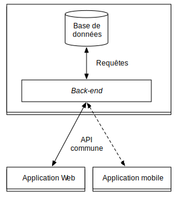

# Description technique
Réaliser un outil tel que décrit précédemment nécessite l'utilisation d'un ensemble de technologies logicielles ainsi qu'une plateforme matérielle gérant l'hébergement de la solution.

Architecture choisie.

## Architecture logicielle
Notre outil sera composé de deux parties principales : le *front-end* et le *back-end*, basés intégralement sur des technologies libres, accélérant ainsi notablement la conception de l'outil tout en diminuant les coûts de développement.

Le *front-end* est la partie visible par les utilisateurs. Conformément à l'analyse fonctionnelle, il convient de proposer un outil simple à gérer qui ne nécessite pas de logiciel à installer. Nous proposons ainsi un outil accessible via une interface Web : cela permet de s'affranchir des contraintes d'installation. De plus, ce mode de fonctionnement permet une mise à jour transparente de l'application : il suffit que les utilisateurs visitent le site pour utiliser la dernière version de l'outil sans action particulière de leur part. On notera de plus qu'une application Web est *de facto* compatible avec tous les systèmes d'exploitation existants. Afin d'accélérer le développement nous utiliserons des technologies basées sur JavaScript et HTML5 afin de construire l'interface. D'un point de vue expérience utilisateur, l'utilisation de langages clients tels que JavaScript permet la création d'interfaces très réactives et interactives. Il n'est pas exclu de créer une application mobile en tant que deuxième *front-end* mais ce n'est pas la priorité du développement.

Le *back-end* est la partie invisible par les utilisateurs et est composé de deux parties. Avant tout, il doit stocker toutes les données de l'application telles que les informations associées aux utilisateurs, leurs conversations et leurs documents. Cette fonction sera assurée par un système de gestion de bases de données. Le *back-end* devra également comporter une couche logicielle permettant au *front-end* d'acquérir et de mettre à jour les données.

## Architecture matérielle
Comme soulevé dans l'analyse fonctionnelle, il convient de mettre à la disposition des utilisateurs un système simple à mettre en place et à gérer. Dans cette optique, nous proposerons une structure d'hébergement de l'application, afin qu'ils n'aient pas à se soucier de cette contrainte.

Dans le but de permettre une flexbilité maximale, nous utiliserons un hébergement de type *cloud*. Ces hébergements supportent une montée en charge rapide en cas de pic d'utilisation. Stratégiquement, ils permettent à l'équipe de se concentrer sur le développement de l'application et de passer le minimum de temps sur son implantation, car l'hébergeur prend en charge toutes les considérations matérielles.
